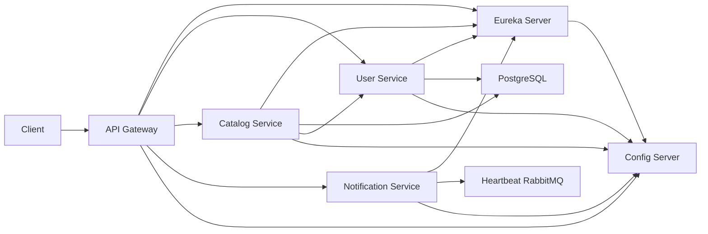

# Práctica 5 – Microservices

Arthur y Rodrigo

## 1. Project Overview

This repository implements a simple Spring Cloud microservices architecture for the UNNOBA "Práctica 5 – Microservices" assignment.

Purpose:
- Demonstrate a microservices ecosystem with service discovery, API gateway, configuration server, and Docker orchestration.
- Provide a beginner-friendly starting point for UNNOBA assignment requirements.

How it relates to the assignment:
- Implements Eureka service discovery,
- Provides an API Gateway for request routing,
- Includes a Config Server and configuration repository,
- Contains sample microservices for users, catalog, and notifications,
- Uses Docker and Docker Compose to launch the full environment.

> Note: some assignment features are not fully implemented in the current code, especially Keycloak/JWT security and RabbitMQ event handling.

## 2. Architecture

The project architecture includes these layers:
- **Client** → **API Gateway** → **Eureka Service Discovery** → **Microservices**
- **Config Server** provides centralized configuration.
- **RabbitMQ** is included for messaging, but event producers/consumers are not implemented.
- **PostgreSQL** stores domain data.

### Services
- `config-server`: central configuration service.
- `eureka-server`: Eureka discovery registry.
- `api-gateway`: edge routing and request forwarding.
- `user-service`: user management API.
- `catalog-service`: catalog API with Feign call to `user-service`.
- `notification-service`: notifications API prepared for RabbitMQ.

### Architecture Diagram



## 3. Project Structure

```
project-root/
├── api-gateway/
│   ├── api-gateway/
│   │   ├── pom.xml
│   │   └── src/main/resources/application.properties
│   └── Dockerfile
├── config-server/
│   ├── pom.xml
│   ├── Dockerfile
│   └── src/main/resources/application.properties
├── config-repo/
│   ├── application.properties
│   ├── api-gateway.properties
│   └── eureka-server.properties
├── eureka-server/
│   ├── eureka-server/
│   │   ├── pom.xml
│   │   └── src/main/resources/application.properties
│   └── Dockerfile
├── user-service/
│   ├── pom.xml
│   ├── Dockerfile
│   ├── src/main/java/ar/edu/unnoba/pdyc2026/userservice/
│   │   ├── UserServiceApplication.java
│   │   ├── BootstrapData.java
│   │   ├── controller/UserController.java
│   │   ├── model/User.java
│   │   └── repository/UserRepository.java
│   └── src/main/resources/application.properties
├── catalog-service/
│   ├── pom.xml
│   ├── Dockerfile
│   ├── src/main/java/ar/edu/unnoba/pdyc2026/catalogservice/
│   │   ├── CatalogServiceApplication.java
│   │   ├── BootstrapData.java
│   │   ├── controller/CatalogController.java
│   │   ├── controller/UserProxyController.java
│   │   ├── client/UserClient.java
│   │   ├── dto/ProductDto.java
│   │   ├── dto/UserDto.java
│   │   ├── model/Product.java
│   │   ├── repository/ProductRepository.java
│   │   └── service/CatalogService.java
│   └── src/main/resources/application.properties
├── notification-service/
│   ├── pom.xml
│   ├── Dockerfile
│   ├── src/main/java/ar/edu/unnoba/pdyc2026/notificationservice/
│   │   ├── NotificationServiceApplication.java
│   │   ├── controller/NotificationController.java
n│   │   └── dto/NotificationMessage.java
│   └── src/main/resources/application.properties
├── docker-compose.yml
└── pom.xml
```

### Important files
- `pom.xml`: root Maven module definition.
- `docker-compose.yml`: full container orchestration.
- `config-repo/`: configuration files for the Config Server.
- `api-gateway/api-gateway/src/main/resources/application.properties`: gateway settings.
- `eureka-server/eureka-server/src/main/resources/application.properties`: Eureka settings.
- `user-service/src/main/java/.../UserController.java`: user endpoints.
- `catalog-service/src/main/java/.../UserClient.java`: OpenFeign client.
- `notification-service/src/main/java/.../NotificationController.java`: notification endpoint.

## 4. Technologies

- **Spring Boot**: service framework for all applications.
- **Spring Cloud**: microservices support.
- **Eureka**: service discovery server.
- **Spring Cloud Gateway**: HTTP routing and gateway.
- **Spring Cloud Config Server**: centralized config management.
- **Keycloak**: mentioned in assignment and some configs, but not installed or active.
- **OpenFeign**: synchronous client for service-to-service calls.
- **RabbitMQ**: message broker container present, but event code is not finished.
- **Docker**: containerization for each service.
- **Docker Compose**: orchestration of all containers.
- **PostgreSQL**: relational database.

## 5. Docker (IMPORTANT)

### Why Docker is used

Docker makes it easy to run service dependencies together without local installation conflicts.
It allows each Spring Boot app to run in an isolated container.

### Why Docker Compose is necessary

Docker Compose starts the complete environment with a single command.
It connects services on a shared Docker network and handles container startup order.

### Containers

- `postgres`: relational database for services.
- `rabbitmq`: message broker.
- `config-server`: stores and serves centralized config.
- `eureka-server`: registers microservices.
- `api-gateway`: routes external requests.
- `user-service`: user management microservice.
- `catalog-service`: product catalog microservice.
- `notification-service`: notifications microservice.

### Network communication

- Services use Docker hostnames, e.g. `eureka-server`, `config-server`, `rabbitmq`.
- The gateway and services connect to Eureka at `http://eureka-server:8761/eureka/`.
- Services connect to Config Server at `http://config-server:8888`.
- `notification-service` connects to RabbitMQ at `rabbitmq:5672`.

### Ports used

- `8888`: Config Server
- `8761`: Eureka Server
- `8080`: API Gateway
- `8101`: User Service
- `8102`: Catalog Service
- `8103`: Notification Service
- `5432`: PostgreSQL
- `5672`: RabbitMQ AMQP
- `15672`: RabbitMQ management UI

### Start environment

```bash
docker compose up --build
```

### Stop environment

```bash
docker compose down
```

Remove volumes:

```bash
docker compose down --volumes
```

### Useful Docker commands

- `docker compose ps`
- `docker compose logs -f api-gateway`
- `docker compose logs -f eureka-server`
- `docker compose logs -f config-server`
- `docker compose logs -f user-service`
- `docker compose logs -f catalog-service`
- `docker compose logs -f notification-service`
- `docker compose exec postgres psql -U appuser -d appdb`

### Troubleshooting

- If services fail to register, check `http://localhost:8761`.
- If Config Server returns errors, verify `config-repo` is mounted and contains config files.
- If RabbitMQ is unreachable, ensure the `rabbitmq` container is running and host is `rabbitmq`.
- If a service cannot connect to database, verify PostgreSQL is running and credentials match.

## 6. Service Discovery

Eureka is used for runtime service registration.
Each microservice includes `eureka.client.service-url.defaultZone=http://eureka-server:8761/eureka/`.
When services start, they register with Eureka and the gateway discovers them.

## 7. API Gateway

The API Gateway receives external HTTP requests and forwards them to backend services.
Current routing is configured through `application.properties`.

Routing paths:
- `/users/**` → `user-service`
- `/catalog/**` → `catalog-service`
- `/notifications/**` → `notification-service`

### JWT and security

The gateway contains a security configuration class in test sources, but runtime authentication is not currently active.
This means JWT validation is planned but not enforced in the current deployment.

## 8. Authentication & Authorization

### Keycloak

Keycloak is referenced in project comments and assignment requirements, but there is no active Keycloak setup in this repository.

### JWT

JWT validation is mentioned in the gateway security config, but it is not wired into the main runtime configuration.

### Perimeter authentication

The intended perimeter authentication layer is the API Gateway.
This project has partial support in test code, but it is not fully functional.

### Fine-grained authorization

Fine-grained authorization inside each microservice is not implemented.
All microservices expose open REST endpoints.

## 9. Communication Between Services

### Synchronous communication (OpenFeign)

`catalog-service` calls `user-service` using OpenFeign.
Implementation:
- `catalog-service/src/main/java/ar/edu/unnoba/pdyc2026/catalogservice/client/UserClient.java`
- `catalog-service/src/main/java/ar/edu/unnoba/pdyc2026/catalogservice/controller/UserProxyController.java`

### Asynchronous communication (RabbitMQ/events)

RabbitMQ is included in `docker-compose.yml` and configured for `notification-service`.
However, message producer and consumer code are not implemented in the current project.

## 10. Databases

The current project uses a single PostgreSQL database (`appdb`) for multiple services.
This is not a perfect microservices design, because each service should ideally own its own database.

## 11. Execution Flow

The request lifecycle is:
1. Client sends request to `http://localhost:8080`.
2. API Gateway receives the request.
3. Gateway looks up the service through Eureka.
4. Gateway forwards the request to the selected microservice.
5. Microservice processes the request and may access PostgreSQL.
6. Microservice returns a response.
7. Gateway returns the response to the client.

## 12. Event Flow

A complete event flow would be:
1. A service publishes an event to RabbitMQ.
2. `notification-service` consumes the event.
3. Notification data is generated and returned.

In this repository, RabbitMQ is configured, but the event producer/consumer implementation is not present.

## 13. Setup Instructions

### Clone repository

```bash
git clone <repository-url>
cd -pdyc2026-JUNIN-00874-2026-1C-practica5sinTerminar1-main
```

### Build and run with Docker Compose

```bash
docker compose up --build
```

### Stop Docker Compose

```bash
docker compose down
```

### Build manually

Because some modules are nested, build each module in its folder:

```bash
cd config-server
./mvnw clean package
cd ../eureka-server/eureka-server
./mvnw clean package
cd ../../api-gateway/api-gateway
./mvnw clean package
cd ../../../user-service
./mvnw clean package
cd ../catalog-service
./mvnw clean package
cd ../notification-service
./mvnw clean package
```

### Run manually

Start each module separately:

```bash
cd config-server
./mvnw spring-boot:run
```

Open new terminals for:

```bash
cd eureka-server/eureka-server
./mvnw spring-boot:run
```

```bash
cd api-gateway/api-gateway
./mvnw spring-boot:run
```

```bash
cd user-service
./mvnw spring-boot:run
```

```bash
cd catalog-service
./mvnw spring-boot:run
```

```bash
cd notification-service
./mvnw spring-boot:run
```

### Verify services

- `http://localhost:8888` → Config Server
- `http://localhost:8761` → Eureka Server
- `http://localhost:8080` → API Gateway
- `http://localhost:8101/users` → User service
- `http://localhost:8102/catalog/products` → Catalog service
- `http://localhost:8103/notifications` → Notification service
- `http://localhost:15672` → RabbitMQ management UI

### Test endpoints

```bash
curl http://localhost:8101/users
curl http://localhost:8102/catalog/products
curl http://localhost:8102/catalog/user/1
curl http://localhost:8103/notifications
```

## 14. Assignment Mapping

| Requirement | Implementation | Status |
| --- | --- | --- |
| Eureka discovery | `eureka-server/eureka-server` | Implemented |
| API Gateway | `api-gateway/api-gateway` | Implemented |
| Config Server | `config-server` + `config-repo` | Partial |
| User microservice | `user-service` | Implemented |
| Catalog microservice | `catalog-service` | Implemented |
| Notification microservice | `notification-service` | Implemented |
| Feign communication | `catalog-service/src/main/java/.../UserClient.java` | Implemented |
| RabbitMQ support | `docker-compose.yml`, `notification-service` config | Configured but incomplete |
| Docker Compose | `docker-compose.yml` | Implemented |
| PostgreSQL | `docker-compose.yml` with shared DB | Implemented |
| Keycloak/JWT | referenced in code/comments | Not implemented |

## 15. Future Improvements

- implement Keycloak and JWT authentication,
- move security configuration into production sources,
- implement RabbitMQ event producers and consumers,
- give each service its own database or schema,
- add health and readiness checks,
- add error handling and resilience patterns,
- add more complete Config Server profiles.

## 16. Troubleshooting

### Docker Compose does not start

- Run `docker compose ps` to identify failed containers.
- Check logs: `docker compose logs -f <service>`.
- Ensure Docker Desktop or Docker Engine is running.

### Services do not register in Eureka

- Open `http://localhost:8761`.
- Confirm each service has the correct Eureka URL.
- Fix `eureka.client.service-url.defaultZone` if needed.

### Config Server fails

- Confirm `config-repo` is mounted in `config-server`.
- Check `config-server` logs for missing files.

### RabbitMQ errors

- Confirm `rabbitmq` container is running.
- Ensure service config uses `spring.rabbitmq.host=rabbitmq`.

### Database errors

- Confirm `postgres` container status.
- Ensure correct database credentials in service properties.
